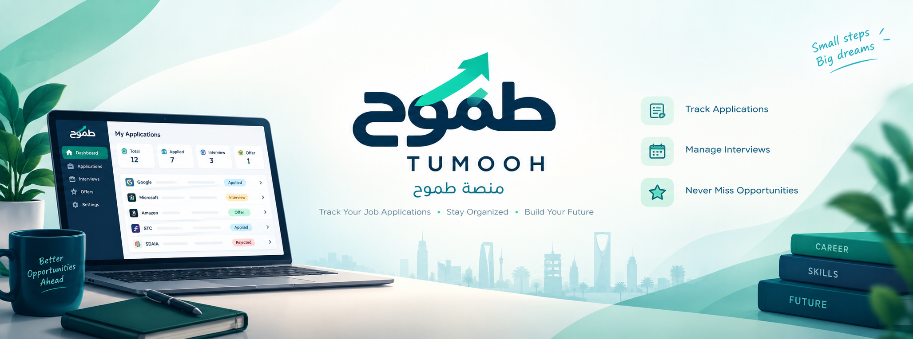
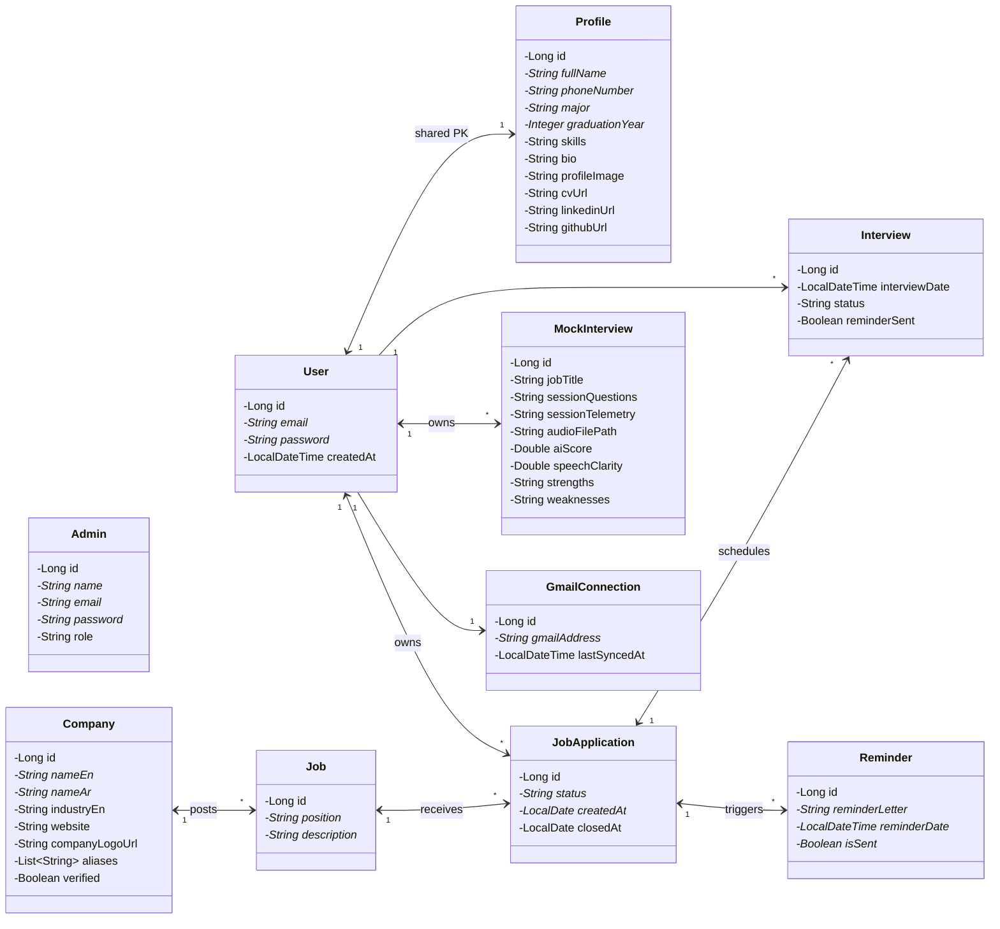

<p align="center">
  
</p>

<h1 align="center">Tumooh</h1>

<p align="center">
  <strong>AI-powered interview &amp; career preparation platform</strong>
</p>

<p align="center">
  
  
  
  
  
  
  
  
  
</p>

---

## About

Tumooh is a full-stack web platform that helps job seekers prepare for interviews and manage their career journey. It combines mock interviews with AI-driven evaluation, a suite of AI career tools, and job/application tracking — all in one place, powered by Google Gemini.

## Features

### 🎤 Mock Interviews
- Guided interview setup and interactive interview room sessions
- AI-powered evaluation and feedback on your answers
- A curated bank of interview questions (including manual interviews)

### 🤖 AI Tools Hub
- **CV Revision** — upload your CV (PDF) and get AI-powered improvement suggestions
- **Cover Letter Generator** — tailored cover letters for any position
- **Skill Gap Analysis** — discover the skills you're missing for your target role
- **Salary Benchmarking** — realistic salary ranges for your role and market
- **STAR Answer Generator** — structured behavioral answers using the STAR method
- **Interview Preparation** — role-specific preparation plans
- **LinkedIn Optimizer** — AI-generated headlines and "About" sections
- **Career Pivot Analysis** — feasibility analysis for changing careers
- **Company Brief** — culture and company insights before you apply

### 📋 Job & Application Tracking
- Browse and manage jobs and companies (Saudi companies included)
- Track applications through their full lifecycle
- Profile management with photo and CV (PDF) uploads

### 🔔 Integrations & Reminders
- **Gmail IMAP sync** — daily inbox sync classifies job-related emails and auto-creates applications, interviews, jobs and companies
- **Gmail SMTP** — HTML interview reminders and mock-interview feedback emails
- **WhatsApp notifications** via UltraMsg when application statuses or interviews change
- **Interview scheduling and reminders**

## APIs & Integrations

| API / Integration | Type | Used for |
|---|---|---|
| **Google Gemini API** (`generativelanguage.googleapis.com`, `gemini-3.5-flash-lite`) | REST · server-side | All AI features: mock-interview evaluation, CV revision, cover letters, skill gap, salary benchmark, STAR answers, interview prep, LinkedIn optimization, career pivot, company brief/recommendations, insights, reply drafting, email classification |
| **Gmail IMAP** (`imap.gmail.com:993`, App Password) | Inbound · server-side | Daily inbox sync (23:59 Asia/Riyadh cron) → Gemini classifies job emails → auto-creates `JobApplication`, `Interview`, `Job`, `Company` records |
| **Gmail SMTP** (`smtp.gmail.com:587`, STARTTLS) | Outbound · server-side | Interview reminder emails and mock-interview feedback emails (Thymeleaf-rendered HTML) |
| **UltraMsg** (`api.ultramsg.com`) | REST · server-side | WhatsApp notifications on application status changes and interview updates |
| **Apache PDFBox** 3.0.3 | Local library | CV PDF text extraction before sending to Gemini |
| **MySQL** | Local database | Persistence (Spring Data JPA / Hibernate) |
| Tailwind CSS CDN · Google Fonts · Google Favicon service | Client-side | Styling, typography, company logos |

## API Reference

All REST endpoints are served from `http://localhost:8080`. There is no global prefix — `/api/v1` is declared per controller. Requests and responses are JSON unless noted (multipart forms are marked).

<details open>
<summary><code>/api/v1/*</code> — Core Resources (27 endpoints)</summary>

#### Users — `/api/v1/users` (7)

| Method | Endpoint | Description |
|---|---|---|
| GET | `/get` | List all users |
| GET | `/get/{id}` | Get user by id |
| POST | `/add` | Register user (body: `UserRequest`) |
| PUT | `/update/{id}` | Update user (body: `UserRequest`) |
| DELETE | `/delete/{id}` | Delete user |
| GET | `/{userId}/mock-interviews/summary` | Mock-interview summary stats for a user |
| GET | `/{userId}/interviews/upcoming` | Upcoming interviews (query: `from`, `status` — optional) |

#### Admins — `/api/v1/admins` (5)

All endpoints require an `adminId` query param for authorization.

| Method | Endpoint | Description |
|---|---|---|
| GET | `?adminId=` | List all admins |
| GET | `/{id}?adminId=` | Get admin by id |
| POST | `?adminId=` | Add admin (body: `Admin`; `adminId` optional for first-admin creation) |
| PUT | `/{id}?adminId=` | Update admin (body: `Admin`) |
| DELETE | `/{id}?adminId=` | Delete admin |

#### Profiles — `/api/v1/profiles` (7)

| Method | Endpoint | Description |
|---|---|---|
| POST | `/user/{userId}` | Create profile (body: `ProfileRequest`) |
| GET | `/user/{userId}` | Get profile by user id |
| GET | `/` | List all profiles |
| PUT | `/user/{userId}` | Update profile (body: `ProfileRequest`) |
| DELETE | `/user/{userId}` | Delete profile |
| POST | `/user/{userId}/upload-cv` | Upload CV (multipart, param: `file`) |
| POST | `/user/{userId}/upload-image` | Upload profile image (multipart, param: `file`) |

#### Jobs — `/api/v1/jobs` (4)

| Method | Endpoint | Description |
|---|---|---|
| GET | `/get` | List all jobs |
| POST | `/add/{companyId}` | Create job under a company (path: `companyId`, body: `Job`) |
| PUT | `/update/{id}` | Update job (body: `Job`) |
| DELETE | `/delete/{id}` | Delete job |

#### Companies — `/api/v1/companies` (4)

| Method | Endpoint | Description |
|---|---|---|
| GET | `/get` | List all companies |
| POST | `/add` | Create company (body: `Company`) |
| PUT | `/update/{id}` | Update company (body: `Company`) |
| DELETE | `/delete/{id}` | Delete company |

</details>

<details>
<summary><code>/api/v1/job-applications</code> — Job Applications (14)</summary>

| Method | Endpoint | Description |
|---|---|---|
| GET | `/get` | List all applications |
| POST | `/add/{userId}/{jobId}` | Create application for user + job (body: `JobApplication`) |
| PUT | `/update/{id}` | Update application (body: `JobApplication`) |
| DELETE | `/delete/{userId}/{applicationId}` | Delete an application |
| GET | `/myApplications/{userId}` | A user's applications |
| PUT | `/update-status/{userId}/{applicationId}` | Change status (body: `ApplicationStatusRequest`) |
| POST | `/add-manual/{userId}` | Manually add an application (body: `ManualApplicationRequest`) |
| POST | `/status/{userId}` | Filter applications by status (body: `ApplicationStatusRequest`) |
| GET | `/history/{userId}/{companyName}` | Application history with a specific company |
| POST | `/period/{userId}` | Applications within a date range (body: `DatesRequest`) |
| GET | `/interviews/{userId}/{applicationId}` | All interviews for an application |
| GET | `/next-step/{userId}/{applicationId}` | AI-suggested next step |
| GET | `/insights/{userId}` | AI insights for a user |
| GET | `/reply/{userId}/{applicationId}` | AI-generated reply message |

</details>

<details>
<summary><code>/api/v1/interviews</code> — Interviews (7)</summary>

| Method | Endpoint | Description |
|---|---|---|
| GET | `/get` | List all interviews |
| GET | `/get/user/{userId}` | Interviews of a user |
| POST | `/add` | Create interview (body: `InterviewRequest`) |
| PUT | `/update/{id}` | Update interview (body: `InterviewRequest`) |
| DELETE | `/delete/{id}` | Delete interview |
| PATCH | `/{id}/status` | Partial status update (body: `InterviewStatusPatchRequest`) |
| POST | `/{id}/send-reminder` | Send interview reminder email |

</details>

<details>
<summary><code>/api/v1/mock-interviews</code> — Mock Interviews (10)</summary>

| Method | Endpoint | Description |
|---|---|---|
| GET | `/get` | List all mock interviews |
| GET | `/get/user/{userId}` | Mock interviews of a user |
| POST | `/add` | Create mock interview (body: `MockInterviewRequest`) |
| PUT | `/update/{id}` | Update mock interview (body: `MockInterviewRequest`) |
| DELETE | `/delete/{id}` | Delete mock interview |
| POST | `/start` | Start a session (body: `MockInterviewRequest` → `MockInterviewStartResponse`) |
| POST | `/{id}/telemetry` | Save session telemetry (`text/plain`, raw string body) |
| POST | `/{id}/evaluate` | AI-evaluate session (idempotent; sends feedback email on first success → `MockInterviewResultsResponse`) |
| GET | `/{id}/results` | Fetch evaluation results |
| POST | `/{id}/email-feedback` | (Re)send feedback email |

</details>

<details>
<summary><code>/api/v1/reminders</code> — Reminders (6)</summary>

| Method | Endpoint | Description |
|---|---|---|
| POST | `/` | Create reminder (body: `ReminderRequest`) |
| GET | `/{id}` | Get reminder by id |
| GET | `/job-application/{jobApplicationId}` | Reminders for a job application |
| GET | `/` | List all reminders |
| PUT | `/{id}` | Update reminder (body: `ReminderRequest`) |
| DELETE | `/{id}` | Delete reminder |

</details>

<details>
<summary><code>/api/v1/gmail</code> — Gmail (3)</summary>

| Method | Endpoint | Description |
|---|---|---|
| POST | `/connect/{userId}` | Link Gmail account (body: `GmailConnectRequest`) |
| POST | `/sync/{userId}` | Trigger manual Gmail sync |
| GET | `/status/{userId}` | Gmail connection status |

</details>

<details>
<summary><code>/api/v1/ai/*</code> — AI Tools (10)</summary>

| Method | Endpoint | Description |
|---|---|---|
| POST | `/cv/revise` | AI CV revision (multipart, param: `file` — PDF → `CvRevisionResponse`) |
| POST | `/cover-letter` | Generate cover letter (body: `CoverLetterRequest`) |
| POST | `/skill-gap` | Analyze skill gap (body: `SkillGapRequest`) |
| POST | `/salary-benchmark` | Benchmark salary (body: `SalaryBenchmarkRequest`) |
| POST | `/star-answer` | STAR-format interview answer (body: `StarAnswerRequest`) |
| POST | `/interview-prep` | Interview preparation guide (body: `InterviewPreparationRequest`) |
| POST | `/linkedin` | LinkedIn headline/about generation (body: `LinkedInProfileRequest`) |
| POST | `/career-pivot` | Career pivot analysis (body: `CareerPivotRequest`) |
| POST | `/company-brief` | Company brief (body: `CompanyBriefRequest`) |
| POST | `/users/{userId}/company-recommendations` | AI company recommendations for a user (no body) |

</details>

<details>
<summary>Web Pages (Thymeleaf) — 20 routes</summary>

| Route | Page |
|---|---|
| `/` | Home |
| `/profile?userId=` | Profile |
| `/mock-interview/setup` | Interview setup (GET form, POST → redirect to room) |
| `/mock-interview/room/{id}` | Interview room |
| `/mock-interview/feedback/{id}` | Feedback page |
| `/career` | Career hub |
| `/career/mock-interviews` | Mock interview history |
| `/career/interviews` | Interviews page |
| `/career/companies` | Companies page |
| `/applications?userId=` | Job applications |
| `/ai-tools` | AI tools hub |
| `/ai-tools/cover-letter` | Cover letter tool |
| `/ai-tools/cv-revise` | CV revision tool |
| `/ai-tools/skill-gap` | Skill gap tool |
| `/ai-tools/salary-benchmark` | Salary benchmark tool |
| `/ai-tools/star-answer` | STAR answer tool |
| `/ai-tools/interview-prep` | Interview prep tool |
| `/ai-tools/linkedin` | LinkedIn tool |
| `/ai-tools/career-pivot` | Career pivot tool |
| `/ai-tools/company-brief` | Company brief tool |

Static: `GET /uploads/**` serves uploaded CVs and profile images from local `file:uploads/`.

</details>

## Tech Stack

| Layer | Technology |
|---|---|
| Language | Java 17 |
| Framework | Spring Boot (Web MVC, Data JPA, Validation, Mail) |
| Templating | Thymeleaf |
| Database | MySQL + Hibernate |
| AI | Google Gemini API (`gemini-3.5-flash-lite`) |
| Email | Gmail IMAP (inbound sync) + Gmail SMTP (outbound notifications) |
| WhatsApp | UltraMsg REST API |
| PDF processing | Apache PDFBox 3.0.3 |
| Build | Maven (wrapper included) |
| Other | Lombok, Jakarta Validation |

## Project Structure

```
src/main/java/org/fadhel/tumoohplatform/
├── advice/          # Global exception handling
├── Api/             # API response & exception models
├── config/          # Gemini, Mail, Web config & seeders
├── controller/      # REST + web controllers
├── dto/             # Request / response DTOs
├── model/           # JPA entities (User, Job, Interview, ...)
├── repository/      # Spring Data JPA repositories
└── service/         # Business logic
src/main/resources/
├── templates/       # Thymeleaf views
├── static/          # CSS, JS, images, logo
└── data/            # Seed data (questions, companies)
```

## Domain Model (UML)



> `*` = required (NOT NULL). `JobApplication.status` ∈ `Applied | InProgress | Offered | Rejected | Withdrawn`. The `appPassword` field on `GmailConnection` exists in the schema but is omitted here.

## Getting Started

### Prerequisites

- **JDK 17+**
- **MySQL 8** running on `localhost:3306`
- Maven (or use the bundled wrapper `./mvnw`)

### 1. Clone the repository

```bash
git clone https://github.com/fadhelalmalki/tumooh-platform.git
cd tumooh-platform
```

### 2. Create the database

```sql
CREATE DATABASE tumooh_db;
```

Default connection settings (`src/main/resources/application.properties`):

```
jdbc:mysql://localhost:3306/tumooh_db
username: root
password: (empty)
```

### 3. Configure environment variables

```bash
export GEMINI_API_KEY=your-gemini-api-key        # required
export ULTRAMSG_INSTANCE_ID=your-instance-id     # optional (WhatsApp)
export ULTRAMSG_TOKEN=your-token                 # optional (WhatsApp)
```

On Windows (PowerShell):

```powershell
$env:GEMINI_API_KEY="your-gemini-api-key"
```

### 4. Run the application

```bash
./mvnw spring-boot:run
```

Then open **http://localhost:8080**

## Configuration

| Variable | Required | Description |
|---|---|---|
| `GEMINI_API_KEY` | ✅ | Google Gemini API key (powers all AI features) |
| `ULTRAMSG_INSTANCE_ID` | ❌ | UltraMsg instance for WhatsApp notifications |
| `ULTRAMSG_TOKEN` | ❌ | UltraMsg token for WhatsApp notifications |

**Tip:** for local overrides, create `src/main/resources/application-local.properties` — it is imported automatically and already git-ignored:

```properties
spring.datasource.username=root
spring.datasource.password=your-password
```

## Testing

```bash
./mvnw test
```

## Build

```bash
./mvnw package
```

Produces a runnable JAR at `target/tumooh-platform-0.0.1-SNAPSHOT.jar`:

```bash
java -jar target/tumooh-platform-0.0.1-SNAPSHOT.jar
```


---

## Fai Alharthi: Job Applications, Gmail Sync and Companies

### What I built
- **Saudi companies dataset**: 1,008 companies with English and Arabic names, aliases, industry, website, description and logo. Loaded automatically by `CompanySeeder` on first startup (`verified = true`).
- **Job application tracker**: full lifecycle of a user's applications, filters, history, interviews and manual entry.
- **AI features (Gemini)**: next step suggestion, job search insights and reply drafts.
- **Gmail sync (IMAP)**: reads company emails every night, adds new applications, updates statuses and adds interviews automatically.
- **WhatsApp notifications (UltraMsg)** when an application status changes from Gmail.
- **Applications page** (`/applications`): dashboard, filters, details drawer, AI tools, interview scheduling and Gmail setup.

### Error responses
| Case | Status | Body |
|---|---|---|
| Business rule error (`ApiException`) | 400 | `{ "message": "..." }` |
| Validation error (`@Valid`) | 400 | `{ "message": "<first field error>" }` |
| AI generation failed | 502 | `AI generation failed. Please try again.` |

### CRUD (short)
| Resource | Endpoints | Notes |
|---|---|---|
| Companies `/api/v1/companies` | `GET /get`, `POST /add`, `PUT /update/{id}`, `DELETE /delete/{id}` | `nameEn` and `industryEn` required, `website` must be a valid URL and unique |
| Jobs `/api/v1/jobs` | `GET /get`, `POST /add/{companyId}`, `PUT /update/{id}`, `DELETE /delete/{id}` | `position` 2 to 100 chars, `description` 10 to 5000 chars, rejects unknown company |
| Job applications `/api/v1/job-applications` | `GET /get`, `POST /add/{userId}/{jobId}`, `PUT /update/{id}` | `status` defaults to `Applied`, `createdAt` is set to today, rejects unknown user or job |

### Job application endpoints `/api/v1/job-applications`
Valid statuses (case sensitive): `Applied`, `InProgress`, `Offered`, `Rejected`, `Withdrawn`

| Method | Endpoint | Accepts | Rejects |
|---|---|---|---|
| GET | `/myApplications/{userId}` | Path only. Returns the user's applications (empty list if none) | User not found |
| POST | `/add-manual/{userId}` | `{ companyName*, position*, description?, status? }` | Missing name or title, description under 10 chars, invalid status, an active application for the same job |
| PUT | `/update-status/{userId}/{applicationId}` | `{ status* }` | Invalid status, application not found, application of another user |
| DELETE | `/delete/{userId}/{applicationId}` | Path only. Also deletes its interviews and reminders | User or application not found, application of another user |
| POST | `/status/{userId}` | `{ status* }` | Invalid status, no applications with this status |
| GET | `/history/{userId}/{companyName}` | Company name in English, Arabic or any alias | Company not found, no applications with this company |
| POST | `/period/{userId}` | `{ startDate*, endDate* }` as `yyyy-MM-dd`, both days included | Start after end, no applications in this period |
| GET | `/interviews/{userId}/{applicationId}` | Path only | Application not found, application of another user, no interviews |

**Manual add logic:** the company is matched by English name, Arabic name or alias. If it does not exist, a new company is created with `verified = false`, industry `Other` and a placeholder logo. The job is reused if the same company, title and description already exist. A second application for the same job is allowed only if the old one is `Rejected` or `Withdrawn`.

### AI endpoints (Gemini) `/api/v1/job-applications`
| Method | Endpoint | Returns | Rejects |
|---|---|---|---|
| GET | `/next-step/{userId}/{applicationId}` | `{ nextStep, reason }` based on company, title, status and interviews | Application not found or of another user |
| GET | `/insights/{userId}` | Counts per status, industries, total interviews, plus AI `strengths`, `concerns`, `recommendations` | User has no applications |
| GET | `/reply/{userId}/{applicationId}` | `[{ subject, reply }]`. `Offered` gives 2 drafts (accept, or ask for time). `Rejected` gives 1 draft. Signed with the profile full name | Any status other than `Offered` or `Rejected` |

### Gmail sync `/api/v1/gmail`
| Method | Endpoint | Accepts | Rejects |
|---|---|---|---|
| POST | `/connect/{userId}` | `{ appPassword* }`. Uses the user's account email, which must be a Gmail address. Logs in to Gmail first to verify | Wrong email or App Password |
| POST | `/sync/{userId}` | Path only. Returns a summary, e.g. `Checked 3 emails: 1 applications added, 1 applications updated` | User not found, Gmail not connected, Gmail cannot be read |
| GET | `/status/{userId}` | Path only. Returns `{ connected, gmailAddress, lastSyncedAt }`. The App Password is never returned | User not found |

**How the sync works**
1. Runs automatically every day at **23:59 (Asia/Riyadh)** for all connected users, or on demand with `/sync`.
2. Reads up to the **20 newest emails** received since the last sync (inbox is opened read only).
3. Gemini classifies each email: `Applied`, `Interview`, `InProgress`, `Offered`, `Rejected` or not job related.
4. `Applied` adds a new application, unless an active one already exists for the same title at that company.
5. `Interview` moves the application to `InProgress` and adds an interview (`SCHEDULED` if a date was found, otherwise `PENDING`).
6. `InProgress`, `Offered` and `Rejected` update the matching application.
7. Emails for companies with no application are ignored. One failing email does not stop the others.
8. A WhatsApp message is sent when a status changes (if the user has a phone number in the profile).

### Applications page `/applications?userId=`
- Stats cards per status and a list of application cards with company logos
- Filters by status, date range and company history
- Add application form and delete with confirmation
- Details drawer: change status, interviews list, schedule an interview (uses `POST /api/v1/interviews/add` and moves the application to `InProgress`), AI next step and AI reply drafts with a copy button
- AI insights panel
- Gmail card: connection status, step by step App Password guide, connect form and a "Check now" button
